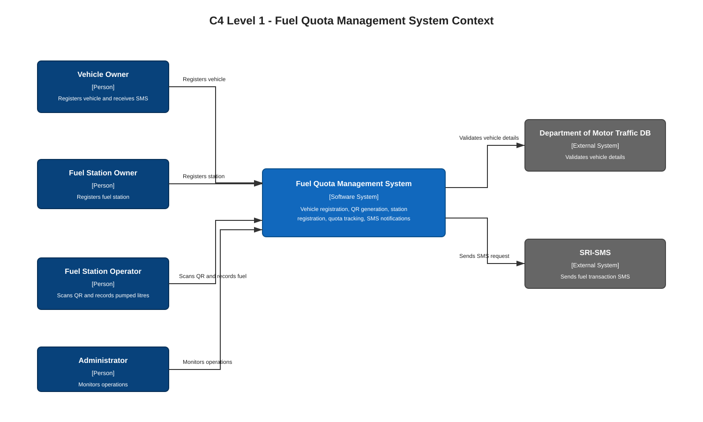
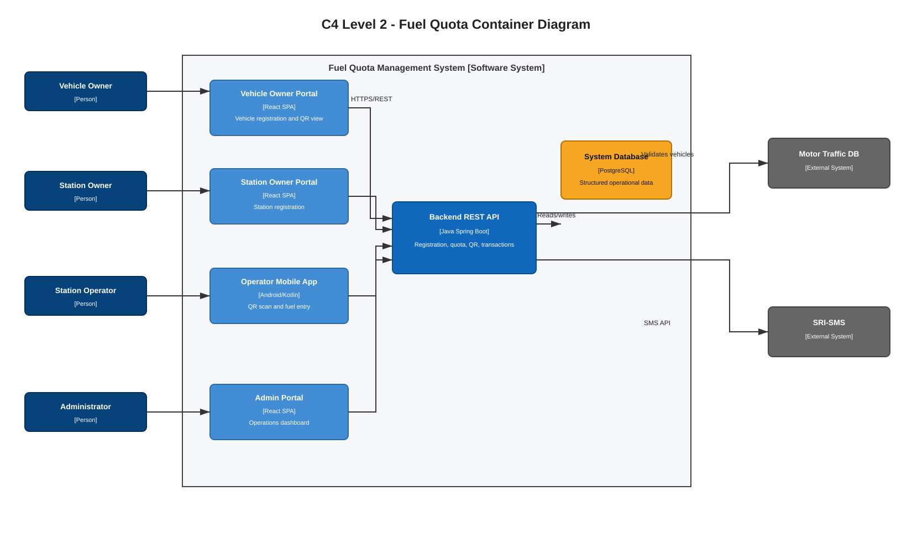
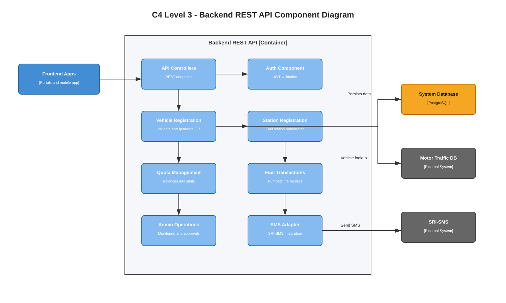
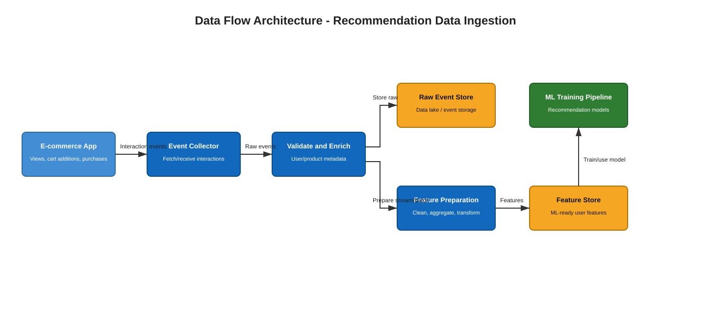

# 2023 Software Architecture Past Paper Answers

## Q1

### Q1(a) Context Diagram

**Question:** Draw a context diagram for the above-mentioned fuel quota management system.

**Answer:**



Editable draw.io source: [diagrams/q1_context.drawio](diagrams/q1_context.drawio)

The context diagram shows the **Fuel Quota Management System** as the central software system. Vehicle owners, fuel station owners, fuel station operators, and administrators use the system. The system integrates with the Department of Motor Traffic database for vehicle validation and SRI-SMS for SMS notifications.

### Q1(b) Container Diagram

**Question:** Draw a container diagram for the above-mentioned system. Clearly mention the technology stack for each container. Briefly explain the reasons behind selecting each technology.

**Answer:**



Editable draw.io source: [diagrams/q1_container.drawio](diagrams/q1_container.drawio)

Suitable technology choices:

- **Vehicle Owner Portal: React SPA** - suitable for a responsive browser-based registration UI.
- **Fuel Station Owner Portal: React SPA** - reuses the same frontend skills and component model.
- **Admin Portal: React SPA** - good for dashboards, operational forms, and tables.
- **Fuel Station Operator App: Android/Kotlin** - suitable because the requirement specifically asks for an Android app and Kotlin is the modern native Android language.
- **Backend REST API: Java Spring Boot** - suitable for secure REST APIs, validation workflows, database access, and maintainable enterprise services.
- **Database: PostgreSQL** - suitable for structured records such as vehicles, owners, stations, quota balances, transactions, and audit data.
- **External integrations: Department of Motor Traffic database and SRI-SMS** - used for vehicle validation and SMS delivery instead of building those capabilities from scratch.

### Q1(c) Backend Component Diagram

**Question:** Draw a component diagram for the backend container of the above system.

**Answer:**



Editable draw.io source: [diagrams/q1_backend_component.drawio](diagrams/q1_backend_component.drawio)

The backend is separated into components for authentication, vehicle registration, station registration, quota management, fuel transaction recording, SMS notification, administration, and external integration. This improves maintainability because each component has a clear responsibility.

### Q1(d) Vehicle Registration API Specification

**Question:** List down the specification (format) of an API call which can be used to register a vehicle in the system. Your answer should mention the HTTP method, the path, and the parameters of the API call. No need to write any source code.

**Answer:**

Example API specification:

```http
POST /api/v1/vehicles/register
Content-Type: application/json
Authorization: Bearer <token>
```

Request body parameters:

```json
{
  "ownerName": "string",
  "ownerNic": "string",
  "mobileNumber": "string",
  "vehicleRegistrationNumber": "string",
  "chassisNumber": "string",
  "vehicleType": "car | van | motorcycle | bus | lorry",
  "fuelType": "petrol | diesel",
  "province": "string"
}
```

Expected successful response:

```json
{
  "vehicleId": "string",
  "qrCodeId": "string",
  "quotaBalanceLitres": 20,
  "status": "REGISTERED"
}
```

The API validates vehicle details through the Department of Motor Traffic database before generating the QR code.

### Q1(e) REST API Authentication

**Question:** Mention an authentication method for the REST API.

**Answer:**

A suitable method is **token-based authentication using OAuth 2.0/OpenID Connect with JWT bearer tokens**.

The user logs in through an identity provider, receives a signed JWT token, and sends it in the `Authorization: Bearer <token>` header for each REST API request. The backend validates the token before allowing access.

### Q1(f) High Registration Traffic Issue

**Question:** Assume that you have deployed this system in a cloud server and made an announcement to the general public asking them to register their vehicles on the platform. Mention one major issue which could occur when a large number of vehicle owners try to access the portal for registration. Explain a quick and cost-effective solution for the mentioned issue.

**Answer:**

One major issue is **server overload**. A large number of users may access the registration portal at the same time, causing slow responses, timeouts, or the application becoming unavailable.

A quick and cost-effective solution is to use **horizontal scaling with a load balancer**. Multiple backend instances can be deployed in the cloud, and the load balancer distributes incoming requests across them. Static frontend files can also be served through a CDN to reduce load on the backend. This improves availability during the registration peak without redesigning the whole system.

## Q2

### Q2(a) Process-Related View

**Question:** Explain the Process-Related View of a component in component level design.

**Answer:**

The process-related view explains how a component behaves at runtime. It focuses on the sequence of processing steps, control flow, data flow, interactions with other components, and how the component responds to events or method calls.

For example, in a vehicle registration component, the process view may show: receive vehicle details, validate input, call the motor traffic database, create the vehicle record, generate a QR code, and return the registration result.

### Q2(b) Component-Based Frontend Development

**Question:** How do modern front-end frameworks and libraries promote and facilitate the adoption of a component-based architecture for front-end development?

**Answer:**

Modern frontend frameworks such as React, Angular, and Vue encourage developers to build the UI as reusable components. Each component can contain its own display logic, state, properties, and events.

This supports component-based architecture because pages can be assembled from smaller components such as forms, tables, buttons, navigation bars, and dashboard widgets. Components can be reused, tested independently, maintained more easily, and replaced without changing the whole frontend.

### Q2(c) Common Closure Principle

**Question:** Explain the Common Closure Principle (CCP) in component level design with an example.

**Answer:**

The Common Closure Principle says that classes or modules that change for the same reason should be grouped into the same component. A change in one requirement should affect as few components as possible.

Example: in a fuel quota system, classes related to quota rules, quota balance calculation, and quota reset schedules should be placed in a **Quota Management** component. If the government changes the weekly quota calculation rule, most changes will be localized inside that component rather than spread across registration, SMS, and admin components.

## Q3

### Q3(a) Recommendation Data Ingestion Architecture

**Question:** Draw a simple diagram to show the architecture of the data ingestion part using a data flow architecture for an e-commerce recommendation system.

**Answer:**



Editable draw.io source: [diagrams/q3_recommendation_ingestion.drawio](diagrams/q3_recommendation_ingestion.drawio)

The data ingestion architecture collects user interaction events such as product views, cart additions, and purchases. These events are validated, enriched with product/user metadata, stored in a data lake or event store, and then transformed into features for machine learning model training or recommendation generation.

### Q3(b) Cross Cutting Concerns

**Question:** What is meant by cross cutting concerns in Layered architecture? Provide one example for cross cutting concerns.

**Answer:**

Cross cutting concerns are system-wide concerns that affect multiple layers or modules instead of belonging to only one layer. They cut across presentation, business, and data layers.

Example: **logging** is a cross cutting concern because UI actions, business operations, database access, and errors may all need to be logged. Other examples include security, validation, auditing, and exception handling.

### Q3(c) Microservices vs Monolithic Architecture

**Question:** Compare and contrast microservices architecture with monolithic architecture, considering scalability, development complexity, maintenance, and deployment.

**Answer:**

| Aspect | Monolithic Architecture | Microservices Architecture |
|---|---|---|
| Scalability | Usually scaled as one whole application. | Individual services can be scaled separately. |
| Development complexity | Simpler to develop initially because everything is in one codebase. | More complex because services, APIs, databases, and network communication must be managed. |
| Maintenance | Can become difficult as the codebase grows and modules become tightly coupled. | Easier to maintain individual services if boundaries are well designed. |
| Deployment | Entire application is deployed together. | Services can be deployed independently. |

## Q4

### Q4(a) Pattern-Based Design

**Question:** Explain the concept of pattern-based design in software architecture.

**Answer:**

Pattern-based design means applying proven reusable solutions to recurring software design problems. Instead of designing everything from scratch, architects use known patterns such as layered architecture, MVC, microservices, repository, adapter, or observer when they fit the problem.

### Q4(b) Levels of Patterns

**Question:** Discuss the various levels (kinds) of patterns and their importance in software development.

**Answer:**

Common levels of patterns include:

- **Architectural patterns**: define the high-level system structure, such as layered architecture, client-server, event-driven architecture, or microservices.
- **Design patterns**: solve object-level or component-level design problems, such as adapter, factory, observer, or strategy.
- **Idioms/programming patterns**: language-specific coding solutions.

They are important because they improve communication, reuse proven solutions, reduce design mistakes, and make systems easier to understand and maintain.

### Q4(c) Object-Oriented Design Pattern Use Case

**Question:** Explain a real world software development related use case where an object-oriented design pattern can be used. Mention the advantages of using the mentioned design pattern for the mentioned scenario.

**Answer:**

A suitable use case is sending notifications through different channels such as SMS, email, and push notifications. The **Strategy pattern** can be used.

Define a common interface:

```java
interface NotificationStrategy {
    void send(Notification notification);
}
```

Then create separate implementations such as `SmsNotificationStrategy`, `EmailNotificationStrategy`, and `PushNotificationStrategy`.

Advantages:

- The system can switch notification methods without changing the main business logic.
- New notification channels can be added easily.
- Provider-specific code is isolated in separate classes.
- The design reduces coupling and improves testability.

### Q4(d) Common Design Mistake

**Question:** Briefly explain a common design mistake in pattern-based design and mention how to avoid such a mistake.

**Answer:**

A common mistake is **overusing patterns** or applying a pattern only because it is popular, even when the problem is simple. This can make the design unnecessarily complex.

To avoid this, first understand the real design problem and apply a pattern only when it clearly improves maintainability, flexibility, scalability, or clarity.
