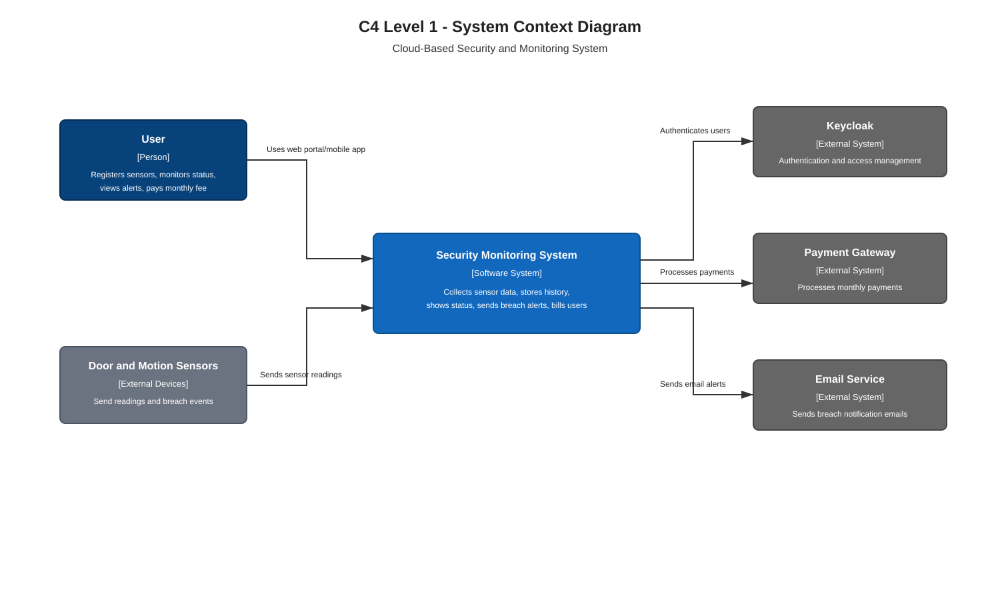
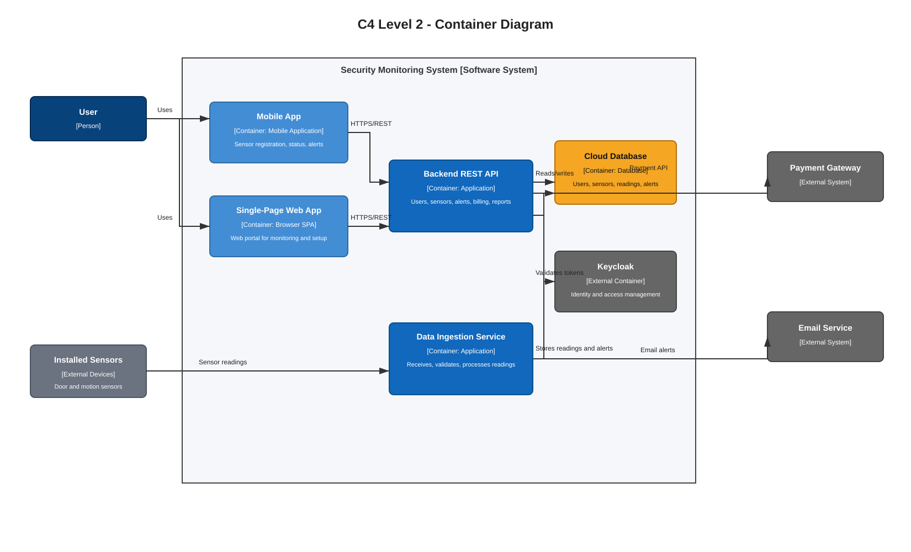
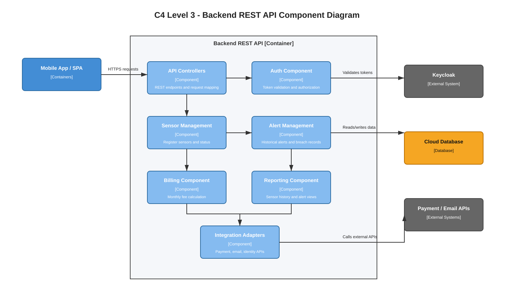
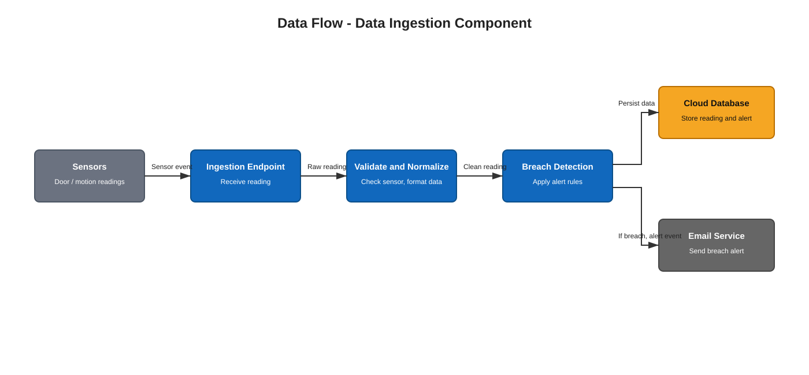

# 2024 Software Architecture Past Paper Answers

## Q1

### Q1(a) Context Diagram

**Question:** Draw a context diagram for the above system.

**Answer:**



Editable draw.io source: [diagrams/q1_context.drawio](diagrams/q1_context.drawio)

The context diagram shows the **Cloud Security and Monitoring System** as the central software system. Users interact through the mobile app and web portal, sensors send readings and breach events, and external services provide authentication, payment processing, and email notification delivery.

### Q1(b) Container Diagram

**Question:** Draw a container diagram for the above system.

**Answer:**



Editable draw.io source: [diagrams/q1_container.drawio](diagrams/q1_container.drawio)

The container diagram shows the mobile app, single-page web app, backend REST API, data ingestion service, cloud database, identity management system, payment gateway, and email service. The data ingestion service follows a data-flow style by receiving, validating, processing, and storing sensor readings.

### Q1(c) Database Selection

**Question:** What type of a database is suited to store the sensor data and other relevant data in this system? Defend your answer.

**Answer:**

A **time-series database** or **NoSQL database optimized for time-series data** is suitable for sensor readings because sensor data is generated continuously, is timestamped, and may arrive in high volume from many sensors. It supports efficient storage and querying of historical readings, trends, breach events, and sensor status over time.

For other structured business data such as users, subscriptions, billing records, and sensor registration details, a **relational database** can also be used. Therefore, a practical design may use a time-series/NoSQL store for sensor readings and a relational database for user, billing, and configuration data.

### Q1(d) Backend API Component Diagram

**Question:** Draw a component diagram for the backend API container.

**Answer:**



Editable draw.io source: [diagrams/q1_backend_component.drawio](diagrams/q1_backend_component.drawio)

The backend API container is divided into components such as authentication, sensor management, alert management, billing, reporting, and integration adapters. This separation improves maintainability because each component has a clear responsibility.

### Q1(e) Backend API Technology Stack

**Question:** Mention a suitable technology stack (programming language/framework) that you can use to build the backend API application. Describe one advantage of using the mentioned technology.

**Answer:**

A suitable backend stack is **Java with Spring Boot**.

One advantage is that Spring Boot is well suited for building REST APIs with authentication, dependency injection, database integration, and enterprise-level maintainability. It also integrates well with identity providers such as Keycloak.

### Q1(f) Single-Page Application Technology Stack

**Question:** Mention a suitable technology stack (programming language/framework) that you can use to build the single-page application. Describe one advantage of using the mentioned technology.

**Answer:**

A suitable SPA stack is **React with JavaScript or TypeScript**.

One advantage is that React supports reusable UI components, which makes it easier to build interactive dashboards showing sensor status, historical alerts, user subscriptions, and sensor registration forms.

### Q1(g) External Services

**Question:** This system relies on many external services like email and payment processors. Mention two advantages and one disadvantage of using these outside services in software implementation.

**Answer:**

Advantages:

- **Faster development**: the team does not need to build complex payment processing or email delivery systems from scratch.
- **Specialized reliability and compliance**: payment and email providers usually offer secure, tested, scalable services with operational support.

Disadvantage:

- **External dependency risk**: if the third-party provider is slow, unavailable, changes pricing, or changes its API, the system's payment or notification features may be affected.

### Q1(h) Data Ingestion Data Flow Diagram

**Question:** Draw a simple diagram to show the data flow of the data ingestion component.

**Answer:**



Editable draw.io source: [diagrams/q1_data_ingestion_flow.drawio](diagrams/q1_data_ingestion_flow.drawio)

Sensor readings flow from physical sensors to the data ingestion endpoint. The ingestion component validates the reading, normalizes it, detects possible breach conditions, stores the reading in the cloud database, and publishes alert events for email notification when needed.

## Q2

### Q2(a) Design Elements

**Question:** Briefly explain the following design elements in a software design model: architectural elements and deployment-level design elements.

**Answer:**

**Architectural elements** describe the major parts of the software system and how they relate to each other. They include components, containers, connectors, layers, services, databases, and external systems. These elements provide the high-level structure of the system and help stakeholders understand how the system is organized.

**Deployment-level design elements** describe where software elements run in the physical or cloud environment. They include servers, virtual machines, containers, mobile devices, networks, databases, load balancers, and cloud services. These elements show how software is mapped to hardware or infrastructure.

### Q2(b) SMS Interface Reusability

**Question:** Consider the following interface designed by a developer for an SMS-sending component. Discuss the issues of this interface concerning reusability. Suggest an improved way to design this interface.

```java
interface SMSService {
    void sendWithABC(Sms sms);
    void sendWithPQR(Sms sms);
}
```

**Answer:**

The interface has poor reusability because it exposes provider-specific methods such as `sendWithABC` and `sendWithPQR`. A client using this interface must know which SMS provider is being used. If a new provider is added, the interface must be changed again, which breaks the open-closed principle and increases coupling.

A better design is to define a provider-neutral interface:

```java
interface SmsService {
    void send(Sms sms);
}
```

Then each provider can have a separate implementation:

```java
class AbcSmsService implements SmsService {
    public void send(Sms sms) {
        // send using ABC provider
    }
}

class PqrSmsService implements SmsService {
    public void send(Sms sms) {
        // send using PQR provider
    }
}
```

The application can select the correct implementation using configuration, dependency injection, or a factory. This improves reusability because client code depends on the abstraction, not on provider-specific methods.

### Q2(c) Pattern-Based Design

**Question:** Explain how to apply pattern-based design to architect a software system. Illustrate your explanation with an example.

**Answer:**

Pattern-based design means using proven architectural or design patterns to solve recurring software design problems. The architect first identifies the main design problem, such as scalability, separation of concerns, communication, or maintainability. Then a suitable pattern is selected, adapted to the system context, and applied consistently.

Example: for a web-based security monitoring system, a **layered architecture pattern** can be used. The presentation layer contains the mobile app and web portal, the business layer contains sensor management and alert rules, and the data layer stores users, sensors, and readings. This separates responsibilities, reduces coupling, and makes the system easier to maintain.

Another example is using the **adapter pattern** for email or SMS providers. The application calls a common notification interface, while provider-specific adapters handle external APIs. This allows providers to be replaced without changing the core business logic.

## Q3

### Q3(a) Abstraction

**Question:** Explain how to apply the concept of abstraction in software design subtasks. Provide a real-world software example to support your explanation.

**Answer:**

Abstraction means representing only the essential features of a component while hiding unnecessary implementation details. In software design subtasks, abstraction is applied by defining clear interfaces, high-level modules, and service responsibilities before focusing on internal code details.

Example: in an online banking system, a `PaymentService` can expose a method such as `makePayment(amount, receiver)` without showing whether the payment is processed through a card network, bank transfer, or wallet provider. Other parts of the system only depend on the payment abstraction. This reduces complexity, improves maintainability, and allows the internal implementation to change without affecting the rest of the system.

### Q3(b) Progressive Transition from Monolith to Microservices

**Question:** Assume you encounter a scaling issue with a monolithic application. Explain an approach to progressively transition this application to a microservices architecture to address the problem. Use an example software application to illustrate your approach.

**Answer:**

A progressive approach is to avoid rewriting the whole monolith at once. First, identify the parts causing scaling or maintenance problems. Then extract one business capability at a time into an independent service, while the remaining features continue running inside the monolith.

Example: in an e-commerce application, the whole system may initially contain product catalog, orders, payments, users, and notifications in one monolithic application. If the product catalog receives heavy traffic, it can be extracted first as a separate **Catalog Service** with its own API and database. The monolith calls this service instead of using its internal catalog module.

Next, other high-value areas such as payment, order processing, and notification can be extracted gradually. An API gateway can route requests to the monolith or to the new services. Shared database access should be reduced over time so each microservice owns its own data. This approach reduces risk, allows independent scaling, and avoids a disruptive full rewrite.
