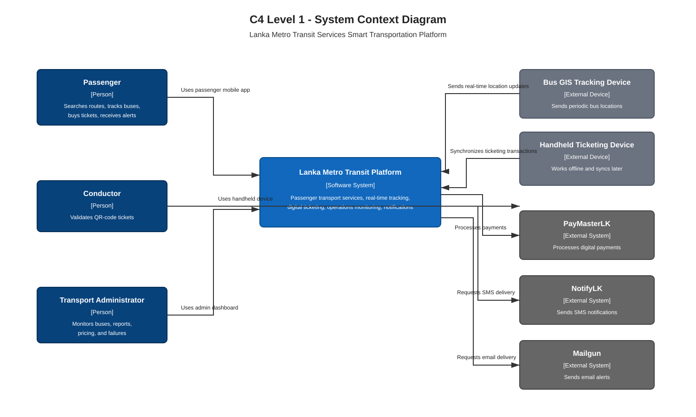
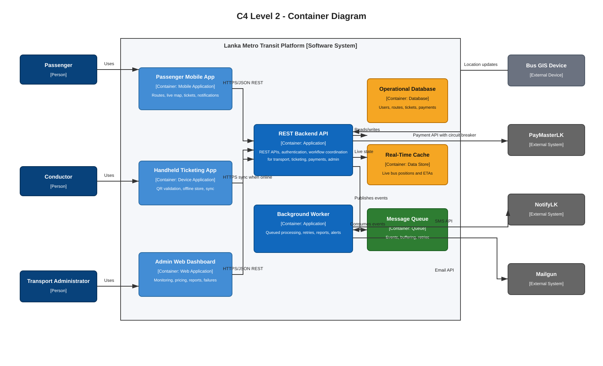
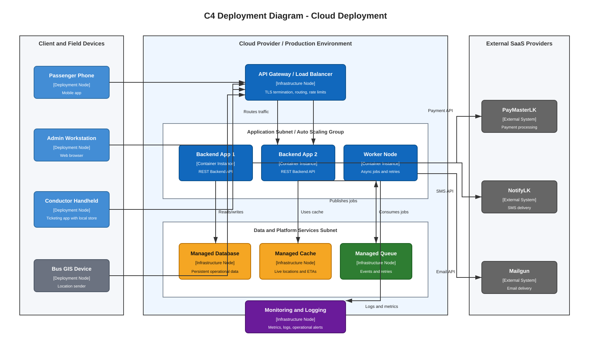

# 2026 Software Architecture Past Paper Answers

## Q1

### Q1(a) Context Diagram

**Question:** Draw a context diagram for the above system.

**Answer:**

Editable draw.io source: [diagrams/q1_context.drawio](diagrams/q1_context.drawio)

The context diagram shows **Lanka Metro Transit Platform** as the central software system. Passengers, conductors, transport administrators, GIS tracking devices, handheld ticketing devices, and third-party services interact with this system.

### Q1(b) Container Diagram

**Question:** Draw a container diagram for the above system.

**Answer:**

Editable draw.io source: [diagrams/q1_container.drawio](diagrams/q1_container.drawio)

The container diagram shows the mobile app, admin dashboard, handheld ticketing app, GIS device client, REST backend, database, real-time cache, message queue, and external integrations.

### Q1(c) Backend Functional Components

**Question:** Identify the major functional components that should exist in the backend architecture of the above system and briefly explain the responsibility of each component.

**Answer:**

- **User and Account Management**: handles passenger registration, login, profile updates, and authentication.
- **Route and Schedule Management**: stores bus routes, stops, route search data, and timetable information.
- **Real-Time Tracking and ETA Component**: receives GIS updates, updates bus positions, calculates estimated arrival times, and exposes live map data.
- **Ticketing Component**: creates digital tickets, generates or validates QR codes, records ticket status, and supports handheld-device synchronization.
- **Payment Component**: integrates with PayMasterLK, records payment status, handles failures, and triggers critical-failure alerts.
- **Notification Component**: sends delay SMS messages through NotifyLK and payment-failure emails through Mailgun.
- **Admin Operations Component**: supports bus monitoring, delay tracking, ticket pricing, sales reports, and device-failure monitoring.
- **Offline Synchronization Component**: accepts delayed ticketing transactions from handheld devices and resolves synchronization after connectivity returns.
- **Monitoring and Logging Component**: logs device failures, payment failures, and operational events for dashboard visibility.

### Q1(d) System Resilience

**Question:** Briefly explain what is meant by system resilience in distributed systems. Identify three ways a system can be designed to continue functioning when some components fail or when the system is under high load.

**Answer:**

System resilience is the ability of a distributed system to continue providing acceptable service when some components fail, external services are unavailable, network connectivity is unstable, or traffic load is high.

Three suitable techniques are:

- **Redundancy and replication**: run multiple backend instances and replicated data stores so another instance can serve requests if one fails.
- **Load balancing and horizontal scaling**: distribute peak-hour passenger traffic across several backend servers.
- **Asynchronous messaging and queues**: buffer location updates, ticket synchronization, and notifications so temporary failures do not lose data.

The system can also use offline mode for handheld devices so ticket validation continues during network outages.

### Q1(e) Deployment Diagram

**Question:** Draw a deployment diagram for a cloud-based deployment of this system.

**Answer:**

Editable draw.io source: [diagrams/q1_deployment.drawio](diagrams/q1_deployment.drawio)

The deployment diagram shows passenger phones, administrator browsers, conductor handheld devices, and bus GIS devices connecting through the internet to a cloud-hosted API gateway and multiple backend instances. The backend uses managed database, cache, queue, worker, and monitoring services, and integrates with PayMasterLK, NotifyLK, and Mailgun.

### Q1(f) Integration Pattern

**Question:** Third-party integrations may introduce reliability issues into distributed systems. Mention one suitable system integration pattern that can be used to handle failures in external service calls and briefly explain how it helps.

**Answer:**

A suitable pattern is the **Circuit Breaker pattern**.

When an external service such as PayMasterLK, NotifyLK, or Mailgun repeatedly fails or times out, the circuit breaker stops sending requests to that service for a short period. This prevents backend threads and resources from being exhausted by repeated failing calls. The system can return a controlled error, retry later through a queue, or use a fallback action. After a recovery period, the circuit breaker allows test requests to check whether the external service is healthy again.

## Q2

### Q2(a) Advantages of Defining Architecture Before Implementation

**Question:** It is usually preferred to define and finalize the architecture of a software system before moving on to the implementation phase of the system. Name three advantages of defining a proper architecture to a system before the implementation of the system.

**Answer:**

Three advantages are:

- **Improves quality attributes**: architecture helps address reliability, scalability, performance, security, and maintainability early.
- **Supports early analysis**: architects can identify risks, cost, performance issues, and scalability problems before coding starts.
- **Improves communication**: architecture diagrams and views give developers, managers, clients, and other stakeholders a shared understanding of the system.

Other valid advantages include managing future change, defining constraints, and recording major early design decisions.

### Q2(b) CCP and CRP

**Question:** Briefly explain the following design principles used in component-based design: Common Closure Principle (CCP) and Common Reuse Principle (CRP).

**Answer:**

**Common Closure Principle (CCP)** means that classes or modules that change for the same reason should be grouped into the same component. If a requirement changes, the affected code should be localized in one component as much as possible. This improves maintainability because fewer components need modification and retesting.

**Common Reuse Principle (CRP)** means that classes or modules that are reused together should be grouped into the same component. A component should not force users to depend on unnecessary classes they do not use. This reduces unwanted dependencies and makes reuse cleaner.

### Q2(c) Separation of Concerns

**Question:** Briefly explain how applying the principle of separation of concerns in component-based design improves system maintainability and extensibility.

**Answer:**

Separation of concerns means dividing a complex system into independent parts, where each part handles a specific responsibility. For example, user-interface logic, business logic, payment logic, and database access should be separated.

This improves maintainability because a change in one concern can often be made without affecting unrelated parts. It improves extensibility because new features can be added by extending or replacing the relevant component instead of changing the whole system. It also reduces coupling and keeps components more cohesive.

## Q3

### Q3(a) Main Components of Event Driven Architecture

**Question:** Name three main components of an Event Driven Architecture (EDA).

**Answer:**

Three main components are:

- **Event producer**: creates and publishes events when something important happens.
- **Event broker/channel**: transports, queues, or routes events between producers and consumers.
- **Event consumer**: subscribes to events and performs actions in response.

### Q3(b) Monolithic vs Microservice Architecture

**Question:** Briefly explain the difference between Monolithic and Microservice architectures in terms of service granularity, communication style, and deployment independence.

**Answer:**

| Aspect | Monolithic Architecture | Microservice Architecture |
|---|---|---|
| Service granularity | One large application containing most features in a single deployable unit. | Many small services, each focused on a specific business capability. |
| Communication style | Components usually communicate through in-process method/function calls. | Services communicate over the network using APIs, messages, or events. |
| Deployment independence | The whole application is normally built and deployed together. | Each service can be developed, scaled, and deployed independently. |

### Q3(c) Compensating Actions in the SAGA Pattern

**Question:** In a distributed system, a business process may involve multiple independent services. Briefly describe the role of compensating actions in the SAGA pattern.

**Answer:**

The SAGA pattern manages long-running business transactions across multiple independent services without using one global database transaction.

Each step in a saga performs a local transaction in one service. If all steps succeed, the whole business process completes. If one step fails, previous successful steps are undone using **compensating actions**.

Example: if ticket booking succeeds but payment later fails, a compensating action can cancel the ticket reservation and release the seat. These actions do not always perform a perfect technical rollback; instead, they perform business-level undo operations that return the system to an acceptable consistent state.

Compensating actions are important because microservices usually own separate databases and cannot rely on one centralized transaction manager.

### Q3(d) Cascading Failures

**Question:** Briefly explain what is meant by cascading failures in distributed systems and why they are particularly dangerous in tightly coupled architectures. Briefly mention one technique used to isolate failures and prevent system-wide impact.

**Answer:**

A cascading failure happens when the failure or slowdown of one component spreads to other dependent components. For example, if the payment service becomes slow, backend requests may wait too long, consume threads, overload the API layer, and eventually affect unrelated user operations.

It is dangerous in tightly coupled architectures because components depend heavily on each other. A small failure can quickly become a system-wide outage.

One technique to prevent system-wide impact is the **Bulkhead pattern**. It isolates resources such as thread pools, connections, or service instances for different parts of the system. If one component fails or becomes overloaded, the isolated resource limit prevents it from consuming resources needed by the rest of the system.
